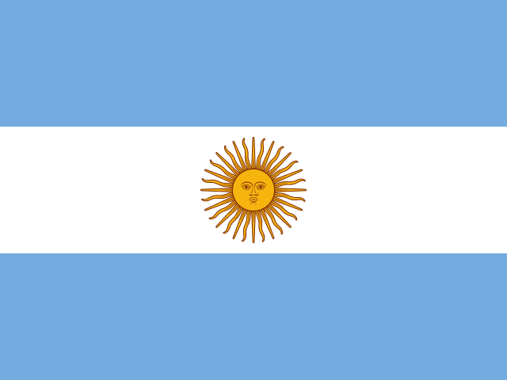
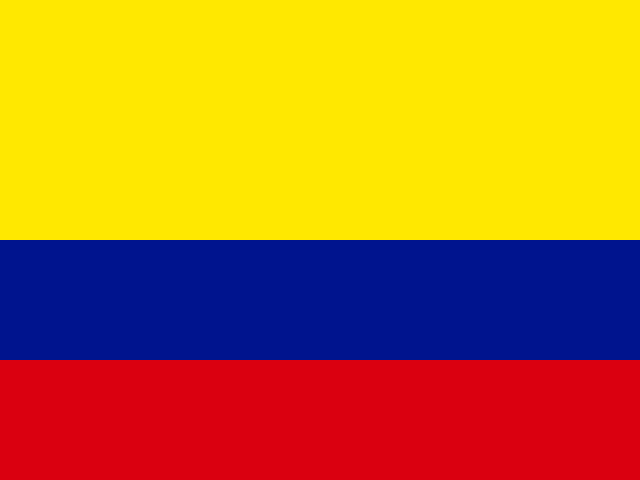
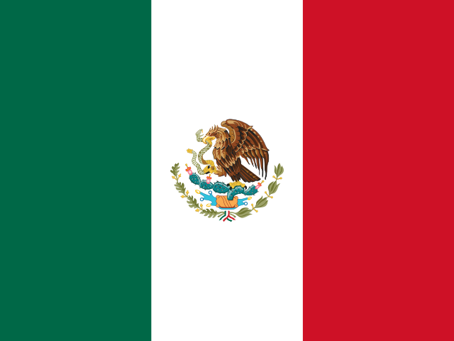
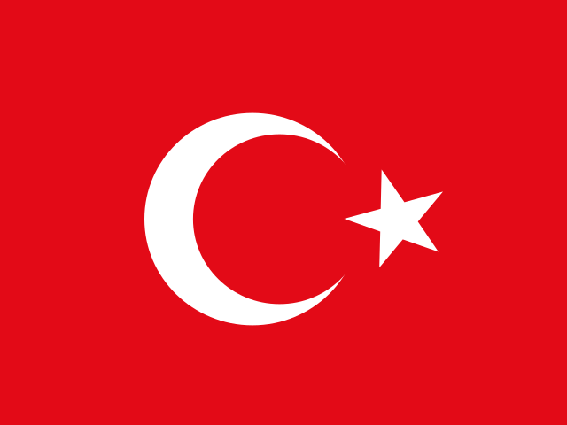
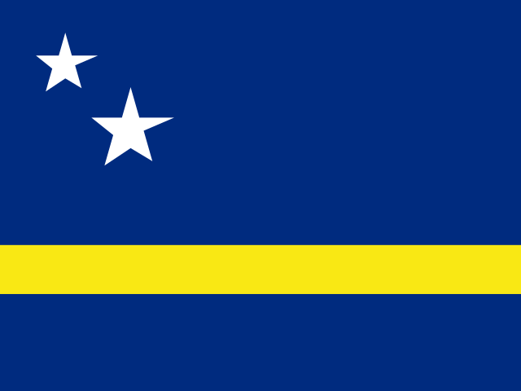
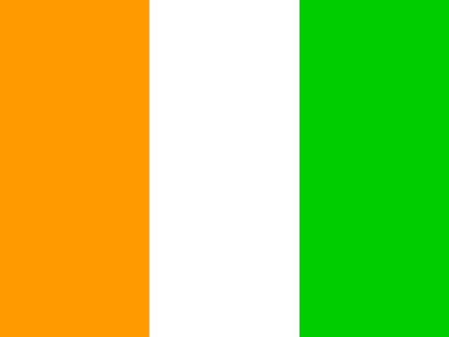
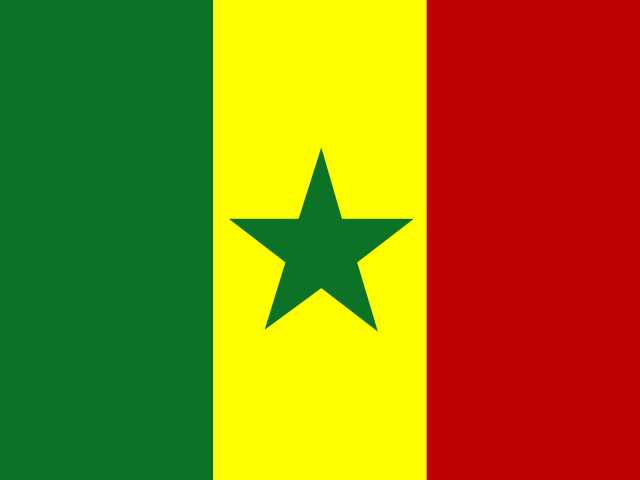
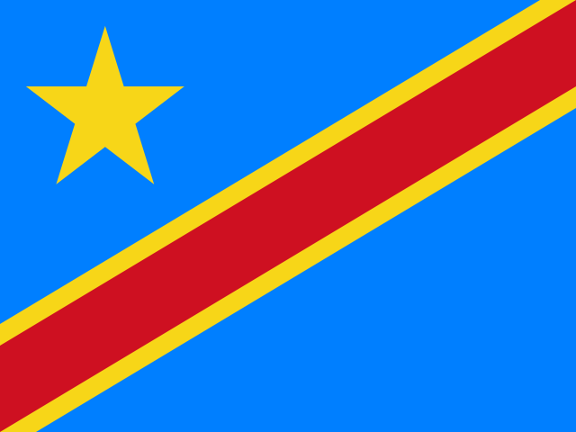
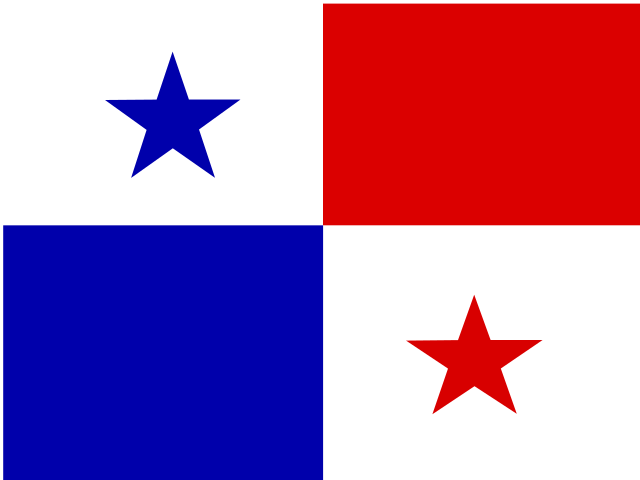

# Holi.
En este repo vas a encontrar todo el código del proyecto Oloráculo: un oráculo del mundial que funciona como huele. 

## [Video con lore y explicación](https://youtu.be/cvPeS0qAikw?si=yHv5wKkk5lqgYXhn)

<!-- oloraculo:snapshots:start -->
## Predicciones más recientes
_A medida que se recibe nueva información y se juegan partidos reales, el Oloráculo ajusta sus predicciones y las publica acá. A continuación vas a encontrar las más recientes._

### Torneo

_Generado 2026-06-14 16:11 UTC a través de 10,000 simulaciones._

| Team | Group | Qualify | QF | SF | Final | Champion |
| --- | --- | ---: | ---: | ---: | ---: | ---: |
|  England | L | 92 % | 34 % | 20 % | 11 % | **5.9 %** |
|  France | I | 82 % | 32 % | 19 % | 10 % | **5.8 %** |
|  Brazil | C | 90 % | 33 % | 19 % | 10 % | **5.7 %** |
|  Japan | F | 86 % | 31 % | 18 % | 10 % | **5.7 %** |
|  Argentina | J | 84 % | 31 % | 17 % | 10 % | **5.6 %** |
|  Portugal | K | 81 % | 32 % | 18 % | 10 % | **5.6 %** |
|  Colombia | K | 80 % | 31 % | 18 % | 10 % | **5.3 %** |
|  Spain | H | 91 % | 31 % | 17 % | 10 % | **5.3 %** |
|  Belgium | G | 81 % | 29 % | 16 % | 9 % | **4.8 %** |
|  Algeria | J | 81 % | 27 % | 15 % | 8 % | **4.1 %** |
|  Iran | G | 80 % | 27 % | 15 % | 8 % | **4.1 %** |
|  Netherlands | F | 83 % | 28 % | 15 % | 8 % | **4.0 %** |
|  Morocco | C | 87 % | 26 % | 14 % | 7 % | **3.7 %** |
|  Australia | D | 97 % | 28 % | 14 % | 7 % | **3.4 %** |
|  United States | D | 97 % | 28 % | 14 % | 7 % | **3.2 %** |
|  Germany | E | 87 % | 26 % | 13 % | 6 % | **3.0 %** |

### Grupos

<details open>
<summary><strong>Group A</strong></summary>

| Match | Status | Result / Pick | H | D | A |
| --- | --- | --- | ---: | ---: | ---: |
|  Mexico vs  South Africa | FT | **2-0** <br><sub>Prediction: 1-1; 3+ goles 38 %; 4+ 18 %; modal 1-0</sub> | 52 % | 28 % | 20 % |
|  South Korea vs  Czechia | FT | **2-1** <br><sub>Prediction: 2-1; 3+ goles 57 %; 4+ 34 %; modal 1-1</sub> | 54 % | 23 % | 23 % |
|  South Africa vs  Czechia | Jun 18 16:00 UTC | 1-1 <br><sub>3+ goles 45 %; 4+ 24 %</sub> | 32 % | 28 % | 40 % |
|  Mexico vs  South Korea | Jun 19 01:00 UTC | 1-1 <br><sub>3+ goles 44 %; 4+ 23 %</sub> | 37 % | 29 % | 35 % |
|  Mexico vs  Czechia | Jun 25 01:00 UTC | 2-1 <br><sub>3+ goles 49 %; 4+ 27 %; modal 1-1</sub> | 52 % | 25 % | 23 % |
|  South Africa vs  South Korea | Jun 25 01:00 UTC | 1-1 <br><sub>3+ goles 45 %; 4+ 24 %; modal 0-1</sub> | 20 % | 26 % | 55 % |

</details>

<details open>
<summary><strong>Group B</strong></summary>

| Match | Status | Result / Pick | H | D | A |
| --- | --- | --- | ---: | ---: | ---: |
|  Qatar vs  Switzerland | FT | **1-1** <br><sub>Prediction: 1-2; 3+ goles 62 %; 4+ 40 %</sub> | 18 % | 21 % | 61 % |
|  Canada vs  Qatar | Jun 18 22:00 UTC | 2-1 <br><sub>3+ goles 53 %; 4+ 31 %; modal 1-0</sub> | 61 % | 22 % | 17 % |
|  Canada vs  Switzerland | Jun 24 19:00 UTC | 2-1 <br><sub>3+ goles 47 %; 4+ 25 %; modal 1-1</sub> | 36 % | 28 % | 36 % |
|  Bosnia and Herzegovina vs  Qatar | Scheduled | 1-2 <br><sub>3+ goles 50 %; 4+ 28 %; modal 1-1</sub> | 27 % | 26 % | 47 % |
|  Bosnia and Herzegovina vs  Switzerland | Scheduled | 1-2 <br><sub>3+ goles 56 %; 4+ 33 %; modal 0-2</sub> | 12 % | 20 % | 68 % |
|  Canada vs  Bosnia and Herzegovina | Final | **1-1** <br><sub>Prediction: 2-1; 3+ goles 47 %; 4+ 25 %; modal 1-0</sub> | 67 % | 21 % | 12 % |

</details>

<details open>
<summary><strong>Group C</strong></summary>

| Match | Status | Result / Pick | H | D | A |
| --- | --- | --- | ---: | ---: | ---: |
|  Brazil vs  Morocco | FT | **1-1** <br><sub>Prediction: 2-1; 3+ goles 49 %; 4+ 27 %; modal 1-1</sub> | 37 % | 27 % | 36 % |
|  Haiti vs  Scotland | FT | **0-1** <br><sub>Prediction: 1-2; 3+ goles 54 %; 4+ 32 %; modal 1-1</sub> | 33 % | 26 % | 41 % |
|  Morocco vs  Scotland | Jun 19 22:00 UTC | 2-1 <br><sub>3+ goles 49 %; 4+ 27 %; modal 1-0</sub> | 55 % | 25 % | 20 % |
|  Brazil vs  Haiti | Jun 20 00:30 UTC | 2-1 <br><sub>3+ goles 61 %; 4+ 39 %</sub> | 63 % | 21 % | 17 % |
|  Brazil vs  Scotland | Jun 24 22:00 UTC | 2-1 <br><sub>3+ goles 54 %; 4+ 32 %; modal 1-1</sub> | 57 % | 23 % | 20 % |
|  Morocco vs  Haiti | Jun 24 22:00 UTC | 2-1 <br><sub>3+ goles 56 %; 4+ 34 %; modal 1-1</sub> | 60 % | 22 % | 18 % |

</details>

<details open>
<summary><strong>Group D</strong></summary>

| Match | Status | Result / Pick | H | D | A |
| --- | --- | --- | ---: | ---: | ---: |
|  United States vs  Paraguay | FT | **4-1** <br><sub>Prediction: 2-1; 3+ goles 46 %; 4+ 25 %; modal 1-1</sub> | 50 % | 26 % | 23 % |
|  Australia vs  Turkey | FT | **2-0** <br><sub>Prediction: 2-1; 3+ goles 55 %; 4+ 33 %; modal 1-1</sub> | 48 % | 25 % | 27 % |
|  United States vs  Australia | Jun 19 19:00 UTC | 1-2 <br><sub>3+ goles 51 %; 4+ 29 %; modal 1-1</sub> | 36 % | 27 % | 38 % |
|  Paraguay vs  Turkey | Jun 20 03:00 UTC | 1-2 <br><sub>3+ goles 47 %; 4+ 25 %; modal 1-1</sub> | 34 % | 27 % | 38 % |
|  Paraguay vs  Australia | Jun 26 02:00 UTC | 1-1 <br><sub>3+ goles 38 %; 4+ 18 %; modal 0-1</sub> | 22 % | 29 % | 49 % |
|  United States vs  Turkey | Jun 26 02:00 UTC | 2-1 <br><sub>3+ goles 64 %; 4+ 42 %; modal 1-1</sub> | 53 % | 22 % | 25 % |

</details>

<details open>
<summary><strong>Group E</strong></summary>

| Match | Status | Result / Pick | H | D | A |
| --- | --- | --- | ---: | ---: | ---: |
|  Germany vs  Curacao | Jun 14 17:00 UTC | 2-1 <br><sub>3+ goles 64 %; 4+ 42 %; modal 2-0</sub> | 69 % | 18 % | 13 % |
|  Ivory Coast vs  Ecuador | Jun 14 23:00 UTC | 1-1 <br><sub>3+ goles 30 %; 4+ 13 %; modal 0-0</sub> | 34 % | 32 % | 34 % |
|  Germany vs  Ivory Coast | Jun 20 20:00 UTC | 2-1 <br><sub>3+ goles 47 %; 4+ 25 %; modal 1-1</sub> | 39 % | 27 % | 34 % |
|  Curacao vs  Ecuador | Jun 21 00:00 UTC | 0-2 <br><sub>3+ goles 43 %; 4+ 22 %; modal 0-1</sub> | 17 % | 25 % | 58 % |
|  Curacao vs  Ivory Coast | Jun 25 20:00 UTC | 1-2 <br><sub>3+ goles 47 %; 4+ 26 %; modal 0-1</sub> | 15 % | 23 % | 61 % |
|  Germany vs  Ecuador | Jun 25 20:00 UTC | 1-1 <br><sub>3+ goles 44 %; 4+ 23 %</sub> | 41 % | 28 % | 31 % |

</details>

<details open>
<summary><strong>Group F</strong></summary>

| Match | Status | Result / Pick | H | D | A |
| --- | --- | --- | ---: | ---: | ---: |
|  Netherlands vs  Japan | Jun 14 20:00 UTC | 1-2 <br><sub>3+ goles 54 %; 4+ 32 %; modal 1-1</sub> | 35 % | 27 % | 38 % |
|  Sweden vs  Tunisia | Jun 15 02:00 UTC | 1-2 <br><sub>3+ goles 47 %; 4+ 25 %; modal 1-1</sub> | 33 % | 28 % | 38 % |
|  Netherlands vs  Sweden | Jun 20 17:00 UTC | 2-1 <br><sub>3+ goles 66 %; 4+ 44 %</sub> | 58 % | 21 % | 21 % |
|  Japan vs  Tunisia | Jun 21 04:00 UTC | 1-1 <br><sub>3+ goles 40 %; 4+ 20 %; modal 1-0</sub> | 51 % | 28 % | 22 % |
|  Japan vs  Sweden | Jun 25 23:00 UTC | 2-1 <br><sub>3+ goles 63 %; 4+ 41 %</sub> | 61 % | 21 % | 19 % |
|  Netherlands vs  Tunisia | Jun 25 23:00 UTC | 1-1 <br><sub>3+ goles 43 %; 4+ 22 %</sub> | 48 % | 27 % | 24 % |

</details>

<details open>
<summary><strong>Group G</strong></summary>

| Match | Status | Result / Pick | H | D | A |
| --- | --- | --- | ---: | ---: | ---: |
|  Belgium vs  Egypt | Jun 15 19:00 UTC | 1-1 <br><sub>3+ goles 41 %; 4+ 20 %; modal 1-0</sub> | 46 % | 28 % | 25 % |
|  Iran vs  New Zealand | Jun 16 01:00 UTC | 2-1 <br><sub>3+ goles 52 %; 4+ 29 %; modal 1-1</sub> | 52 % | 25 % | 23 % |
|  Belgium vs  Iran | Jun 21 19:00 UTC | 2-1 <br><sub>3+ goles 51 %; 4+ 29 %; modal 1-1</sub> | 38 % | 27 % | 36 % |
|  Egypt vs  New Zealand | Jun 22 01:00 UTC | 1-1 <br><sub>3+ goles 39 %; 4+ 19 %</sub> | 39 % | 30 % | 32 % |
|  Belgium vs  New Zealand | Jun 27 03:00 UTC | 2-1 <br><sub>3+ goles 55 %; 4+ 32 %; modal 1-1</sub> | 54 % | 24 % | 22 % |
|  Egypt vs  Iran | Jun 27 03:00 UTC | 1-1 <br><sub>3+ goles 38 %; 4+ 18 %; modal 0-1</sub> | 26 % | 29 % | 45 % |

</details>

<details open>
<summary><strong>Group H</strong></summary>

| Match | Status | Result / Pick | H | D | A |
| --- | --- | --- | ---: | ---: | ---: |
|  Saudi Arabia vs  Uruguay | Jun 15 22:00 UTC | 1-1 <br><sub>3+ goles 32 %; 4+ 14 %; modal 0-1</sub> | 22 % | 31 % | 47 % |
|  Spain vs  Saudi Arabia | Jun 21 16:00 UTC | 2-0 <br><sub>3+ goles 42 %; 4+ 22 %; modal 1-0</sub> | 58 % | 25 % | 17 % |
|  Spain vs  Uruguay | Jun 27 00:00 UTC | 1-1 <br><sub>3+ goles 42 %; 4+ 21 %</sub> | 44 % | 28 % | 28 % |
|  Cape Verde vs  Saudi Arabia | Scheduled | 1-1 <br><sub>3+ goles 32 %; 4+ 14 %; modal 0-1</sub> | 27 % | 31 % | 41 % |
|  Cape Verde vs  Uruguay | Scheduled | 0-2 <br><sub>3+ goles 39 %; 4+ 19 %; modal 0-1</sub> | 17 % | 27 % | 56 % |
|  Spain vs  Cape Verde | Scheduled | 2-1 <br><sub>3+ goles 51 %; 4+ 29 %; modal 2-0</sub> | 68 % | 21 % | 12 % |

</details>

<details open>
<summary><strong>Group I</strong></summary>

| Match | Status | Result / Pick | H | D | A |
| --- | --- | --- | ---: | ---: | ---: |
|  France vs  Senegal | Jun 16 19:00 UTC | 2-1 <br><sub>3+ goles 47 %; 4+ 25 %; modal 1-1</sub> | 41 % | 27 % | 32 % |
|  Iraq vs  Norway | Jun 16 22:00 UTC | 1-1 <br><sub>3+ goles 43 %; 4+ 22 %; modal 0-1</sub> | 22 % | 27 % | 51 % |
|  France vs  Iraq | Jun 22 21:00 UTC | 1-1 <br><sub>3+ goles 41 %; 4+ 21 %; modal 1-0</sub> | 56 % | 26 % | 18 % |
|  Senegal vs  Norway | Jun 23 00:00 UTC | 2-1 <br><sub>3+ goles 51 %; 4+ 28 %; modal 1-1</sub> | 38 % | 27 % | 36 % |
|  France vs  Norway | Jun 26 19:00 UTC | 2-1 <br><sub>3+ goles 56 %; 4+ 33 %; modal 1-1</sub> | 43 % | 25 % | 31 % |
|  Senegal vs  Iraq | Jun 26 19:00 UTC | 1-1 <br><sub>3+ goles 35 %; 4+ 16 %; modal 1-0</sub> | 50 % | 29 % | 21 % |

</details>

<details open>
<summary><strong>Group J</strong></summary>

| Match | Status | Result / Pick | H | D | A |
| --- | --- | --- | ---: | ---: | ---: |
|  Argentina vs  Algeria | Jun 17 01:00 UTC | 2-1 <br><sub>3+ goles 51 %; 4+ 29 %; modal 1-1</sub> | 39 % | 26 % | 34 % |
|  Austria vs  Jordan | Jun 17 04:00 UTC | 2-1 <br><sub>3+ goles 53 %; 4+ 31 %; modal 1-1</sub> | 51 % | 25 % | 24 % |
|  Argentina vs  Austria | Jun 22 17:00 UTC | 2-1 <br><sub>3+ goles 49 %; 4+ 27 %; modal 1-1</sub> | 46 % | 26 % | 27 % |
|  Algeria vs  Jordan | Jun 23 03:00 UTC | 2-1 <br><sub>3+ goles 58 %; 4+ 36 %; modal 1-1</sub> | 60 % | 22 % | 18 % |
|  Algeria vs  Austria | Jun 28 02:00 UTC | 2-1 <br><sub>3+ goles 48 %; 4+ 26 %; modal 1-1</sub> | 42 % | 28 % | 30 % |
|  Argentina vs  Jordan | Jun 28 02:00 UTC | 2-1 <br><sub>3+ goles 60 %; 4+ 38 %; modal 2-0</sub> | 63 % | 21 % | 16 % |

</details>

<details open>
<summary><strong>Group K</strong></summary>

| Match | Status | Result / Pick | H | D | A |
| --- | --- | --- | ---: | ---: | ---: |
|  Portugal vs  Congo DR | Jun 17 17:00 UTC | 1-1 <br><sub>3+ goles 35 %; 4+ 16 %; modal 1-0</sub> | 52 % | 29 % | 19 % |
|  Uzbekistan vs  Colombia | Jun 18 02:00 UTC | 1-1 <br><sub>3+ goles 41 %; 4+ 20 %</sub> | 26 % | 28 % | 46 % |
|  Portugal vs  Uzbekistan | Jun 23 17:00 UTC | 1-1 <br><sub>3+ goles 41 %; 4+ 20 %</sub> | 46 % | 28 % | 26 % |
|  Congo DR vs  Colombia | Jun 24 02:00 UTC | 1-1 <br><sub>3+ goles 35 %; 4+ 16 %; modal 0-1</sub> | 19 % | 29 % | 52 % |
|  Congo DR vs  Uzbekistan | Jun 27 23:30 UTC | 1-1 <br><sub>3+ goles 23 %; 4+ 9 %; modal 0-0</sub> | 26 % | 35 % | 39 % |
|  Portugal vs  Colombia | Jun 27 23:30 UTC | 1-2 <br><sub>3+ goles 52 %; 4+ 30 %; modal 1-1</sub> | 37 % | 26 % | 37 % |

</details>

<details open>
<summary><strong>Group L</strong></summary>

| Match | Status | Result / Pick | H | D | A |
| --- | --- | --- | ---: | ---: | ---: |
|  England vs  Croatia | Jun 17 20:00 UTC | 2-1 <br><sub>3+ goles 51 %; 4+ 29 %; modal 1-1</sub> | 46 % | 26 % | 28 % |
|  Ghana vs  Panama | Jun 17 23:00 UTC | 1-2 <br><sub>3+ goles 51 %; 4+ 29 %; modal 1-1</sub> | 30 % | 26 % | 44 % |
|  England vs  Ghana | Jun 23 20:00 UTC | 2-1 <br><sub>3+ goles 55 %; 4+ 33 %; modal 2-0</sub> | 68 % | 20 % | 12 % |
|  Croatia vs  Panama | Jun 23 23:00 UTC | 2-1 <br><sub>3+ goles 56 %; 4+ 34 %; modal 1-1</sub> | 53 % | 24 % | 23 % |
|  Croatia vs  Ghana | Jun 27 21:00 UTC | 2-1 <br><sub>3+ goles 50 %; 4+ 28 %; modal 1-0</sub> | 59 % | 24 % | 18 % |
|  England vs  Panama | Jun 27 21:00 UTC | 2-1 <br><sub>3+ goles 60 %; 4+ 38 %; modal 2-0</sub> | 64 % | 20 % | 16 % |

</details>
<!-- oloraculo:snapshots:end -->

# Oloraculo

Oloraculo is a .NET 9 Blazor Server app for predicting the 2026 FIFA World Cup. It builds predictions as a small model ladder, explains which model was used, and can run a Monte Carlo simulation of the full tournament.

## What It Does

- Imports seed data from CSV files: groups, historical results, FIFA rankings, and Elo ratings.
- Builds match predictions through layered models:
  - uniform baseline
  - FIFA ranking
  - Elo
  - recent form
  - Poisson scoreline model with a Dixon-Coles-style low-score adjustment
  - goal model adjusted by recent context and player availability when available
- Selects the highest usable model as the final oracle, with notes about missing or skipped signals.
- Runs a repeatable Monte Carlo tournament simulation and stores tournament snapshots.
- Saves match predictions and evaluates them later with Brier score, RPS, log loss, and top-pick accuracy.
- Optionally refreshes rankings, API-Football fixture/context data, and availability news classified through OpenRouter.

## Tech Stack

- .NET 9
- Blazor Server with MudBlazor
- Entity Framework Core 9
- SQLite
- CsvHelper
- xUnit

## Main Screens

- `/` - overview and model ladder
- `/lab` - compare two teams across the prediction ladder
- `/matches` - group-stage fixtures, prediction snapshots, context refresh, and result entry
- `/fixture` - full fixture view
- `/tournament` - run the Monte Carlo tournament simulation
- `/tournament/snapshots` - inspect saved tournament projections
- `/performance` - prediction evaluation metrics
- `/data` - CSV import, rankings refresh, API-Football refresh, and availability refresh

## Project Structure

```text
Oloraculo.sln
Oloraculo.Web/
  Components/          Blazor pages, layout, and shared UI
  DAL/                 EF Core DbContext
  Data/                CSV seed data and video notes
  Helpers/             CSV parsing, team-name normalization, crypto helpers
  Models/              Domain, CSV, API-Football, snapshot, and evaluation models
  Predictors/          Model ladder and final selector
  Probability/         Outcome, scoreline, and tournament probability math
  Services/            Import, prediction, rankings, API, availability, snapshots, evaluation
    Simulation/        World Cup bracket and Monte Carlo engine
Oloraculo.Web.Tests/   xUnit tests
```

## Getting Started

Prerequisites:

- .NET 9 SDK

Run the app:

```bash
dotnet restore
dotnet run --project Oloraculo.Web
```

The SQLite database is created automatically on startup, and the CSV seed data is imported when needed.

## Configuration

Settings live in `Oloraculo.Web/appsettings.json` under the `Oloraculo` section.

Important keys:

- `SimulationCount` and `SimulationSeed`
- `RecentResultCount`
- `GoalModelYearsWindow`
- `RankingRefreshOnStartup`
- `FifaRankingsRawUrl`
- `EloRankingsBaseUrl`
- `ApiFootballApiKey`
- `OpenRouterApiKey`
- `AvailabilitySourceUrls`

Keep secrets such as API-Football and OpenRouter keys in `appsettings.Development.json` or user secrets.

## Testing

```bash
dotnet test
```

## Data Sources

CSV seed data lives in `Oloraculo.Web/Data`:

- `wc2026_groups.csv`
- `historical_results.csv`
- `fifa_rankings.csv`
- `elo_snapshot.csv`
